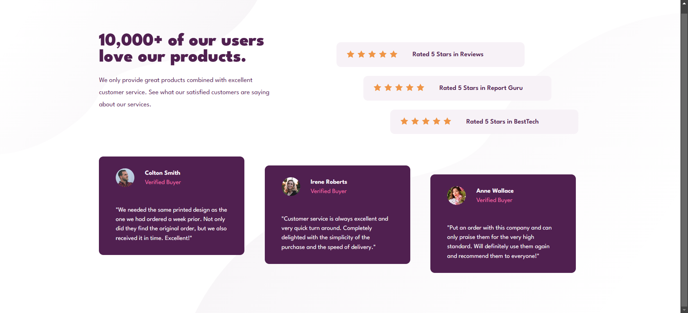

# Frontend Mentor - Social proof section solution

This is a solution to the [Social proof section challenge on Frontend Mentor](https://www.frontendmentor.io/challenges/social-proof-section-6e0qTv_bA). Frontend Mentor challenges help you improve your coding skills by building realistic projects. 

## Table of contents

- [Overview](#overview)
  - [The challenge](#the-challenge)
  - [Screenshot](#screenshot)
  - [Links](#links)
- [My process](#my-process)
  - [Built with](#built-with)
  - [What I learned](#what-i-learned)
  - [Useful resources](#useful-resources)

## Overview

### The challenge

Users should be able to:

- View the optimal layout for the section depending on their device's screen size

### Screenshot

### Links

- Live Site URL: [Here the link!](https://minleya.github.io/social-proof-section/)

## My process

### Built with

- Semantic HTML5 markup
- CSS custom properties
- Flexbox

### What I learned

Really I'm happy that I just made this project because there was tough times for me when I started this challenge. So the main interesting thing that I learned is CSS grid. Ofc I didn't use it in this project bc I found out that I can make this page only with Flexbox only AFTER learning CSS grid. *sigh* well whatever it was intersting experience.

### Useful resources

- [Learn CSS Grin in 20 Minutes](https://www.youtube.com/watch?v=0-DY8J_skZ0) - This helped me to understand hoe css grid works.
- [CSS Grid Generator](https://cssgrid-generator.netlify.app/) - This helped me with checking my using of css grid.
